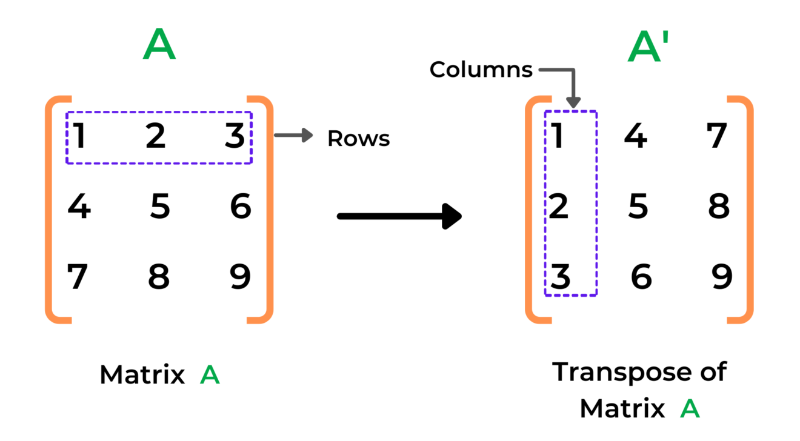

# comp-202-review-exercises

Collection of review exercises for COMP 202 midterm review organized by McGill CSUS.

## Question 1: Vowels counter (Strings, Loops)

Difficulty: 2/5

For this question, write a function `count_vowels` that will take as input a string `expression` and return an integer that represents the number of vowels inside of it.

## Question 2: Longest string of repeating characters (Strings, Loops)

Difficulty: 3/5

For this question, write a function `longest_repeating` that will take as input a string `expression` and return an integer that represents the length of the longest sequence of repeating characters.

## Question 3: Shift up (1D Lists)

Difficulty: 1/5

Write a function `shift_up` that takes input a list. The function will then take the last element of the list, and move it to the start of the list. Here's an example usage

```python
>>> a = [1,2,3,4,5]
>>> shift_up(a)
>>> print(a)
[5,1,2,3,4]
```

You can assume the list has at least one element in it

## Question 4: Maximum integer in a list (1D lists, Loops)

Difficulty: 1/5

You've probably used the `max()` function while coding in python at some point. For the purposes of this exercise, you are not allowed to use it.

Write a function `my_max()` that takes as input a list of numbers (either integers or floats), and return the one that has the highest value. In other words, write the code that would make the built-in `max()` function work

## Question 5: Watered down sudoku (2D Lists and loops)

Difficulty: 5/5

Sudoku is a game where you try to fill a 9x9 board with numbers 1 to 9. The rules are that the numbers cannot reappear twice on each row, each column, or each 3x3 box. For the purposes of this exercise, we will ignore the 3x3 box rule.

A sudoku board can pretty easily be represented as a 2d list of integers in a matrix format. We will use 0 if a cell is empty. Otherwise it has the digit 1-9 in it.

For this exercise, you will write three functions.

1. Write a function `valid_row(n, board)` that checks whether or not the row given by `n` in `board` is valid. That is, there are no repeating integers.
2. Write a function `valid_col(n, board)` that checks whether or not the column given by `n` in `board` is valid.
3. Using the previous two functions, write a function `valid_board(board)` that checks whether or not the board given by `board` is valid in terms of its rows and columns.

You may assume the value `board` is a 2d list of size 9x9, and the value `n` is an integer between 0 and 8 (both inclusive)

> If you want to challenge yourself, you can try implementing a full sudoku board validator by also checking if a given box is valid. This requires a bit of clever thinking, but is entirely possible to make with the concepts you currently have

## Question 6: Find substrings (Strings)

Difficulty: 4/5

Write a function called `count_substrings()` that will take as input two strings: an `input_string` that contains text, and a `substring`. The function will return an integer that represents the number of times `substring` appears in `input_string`. For example

```python
>>> input_string = "Hello, beautiful weather today. Today, I have to host a review for COMP 202"
>>> substring = "Today"
>>> print(count_substrings(input_string, substring))
2
```

Make sure you consider potential overlaps. For example `"ABABAB"` has two instances of the substring `"ABAB"`

> The function is case insensitive. For example `'Hello' == 'HELLO' == 'hello' == 'HeLlO'`

## Question 7: List to String (Strings, 2d lists)

Difficulty: 2/5

Write a function called `list2string`. This function takes in a 2d square list and converts it into a string, going top to bottom, left to right, and returns the final string.

```python
>>> list2string([['H','e','l','l'],['o','o',' ','B','y'],['e']])
Helloo Bye
>>> list2string([['H','a','H','a']])
HaHa
```

## Question 8: Alternating characters concatenation (Strings, loops)

Difficulty: 3/5

Write the following function

```python
def alternate(s1,s2):
    """
    Takes as input two strings. It returns a string that
    is alternating characters of the two strings
    Arguments:
        s1 (str): first string
        s2 (str): second string
    Returns:
        string: result that alternates between both strings
    >>> alternate("ace","bdf")
    'abcdef'
    >>> alternate("I love", "Ice Cream")
    'II cleo vCeream'
    >>> alternate("Hello World!", "")
    'Hello World!'
    """
```

## Question 9: Add space (Strings)

Difficulty: 2/5

Write a function `add_space()` that takes an input string. The function will return a copy of the string, but with a space added before every capital letter. You can assume the string to be non-empty and only containing letters.

```python
>>> add_space("hiIAmPleasedToMeetYou")
"hi I Am Pleased To Meet You"
>>> add_space("I")
" I"
```

## Question 10: Find common elements (1D Lists)

Difficulty: 3/5

Write a function `find_common()` that takes as input two lists. It returns a list that contains the elements that both lists share in common. You can assume the lists are non empty.

```python
>>> find_common([1,2,3], [2,3,4])
[2, 3]
>>> find_common([3,4,8,"Hello", False], [5,5,5,"Hi", None])
[]
```

## Question 11: Shuffle (1D List)

Difficulty: 4/5

Write a function `shuffle()` that takes as input a list, and shuffles its elements randomly.

Coming up with a good shuffling algorithm isn't very intuitive, so here is one that you can try to implement

1. Iterate through the entire list, starting from the first element
2. For every element, generate a random integer between 0 and the size of your list.
3. Swap your current element with the element at the index of your random integer
4. Repeat until you reach the end of the list

```python
>>> a = [1,2,3,4,5,6,7]
>>> shuffle(a)
>>> print(a)
[3, 6, 4, 5, 1, 2, 7]
```

Due to the nature of random algorithms, you may not get the same result as I did above. You can seed your random number generator if you want consistent test results.

## Question 12: Row Sum (2D Lists)

Difficulty: 1/5

Write a function called `row_sum()` that takes as input a 2d list of numbers. The function will return a 1d list, where each element is the sum of the rows in the 2d list

## Question 13: Matrix transposition (2D Lists)

Difficulty: 4/5

If you've taken MATH 133 - Linear Algebra and Geometry or an equivalent course, then you're probably already familiar with matrix transposition. To put it simply, you reflect the matrix on its diagonal. The rows become the columns, and the columns become the rows.

Here's a visualization of what it looks like


> [Source](https://allinpython.com/transpose-of-a-matrix-in-python-with-user-input/)

A matrix is typically represented as a 2d list inside of python. Since transposition is a pretty common operation done on matrices, we would like to be able to use it. Write a function `transpose()` that takes as input a 2d list of elements, and returns the transposed list. You may assume that the 2d list will be rectangular. That is, all the rows have the same length
